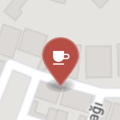
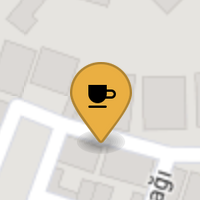
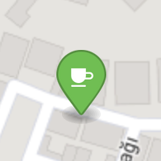

# Awesome TR Café

This repo contains a list of awesome cafés available for work.

Different marker colors represent different download speeds.

<table>
  <tr>
    <th>Marker Symbol</th><th>Download Speed</th><th>Marker Color</th>
  </tr>
  <tr>
    <td></td><td>0 ~ 4 Mbps</td><td>#C24740</td>
  </tr>
  <tr>
    <td></td><td>4 ~ 10 Mbps</td><td>#F3AE1A</td>
  </tr>
  <tr>
    <td></td><td>10+ Mbps</td><td>#50C240</td>
  </tr>
</table>

## Cities

Click the link below to view it on GitHub.

* [İstanbul (15)](istanbul.geojson)

## Contributing

Your contributions are always welcome! Please have a look at the [contribution guidelines](CONTRIBUTING.md) first.

## License

[CC BY](http://creativecommons.org/licenses/by/4.0/)

## Acknowledgements

This repo was forked from [awesome-cn-cafe](https://github.com/ElaWorkshop/awesome-cn-cafe). We acknowledge and are grateful to these developers for their contributions.